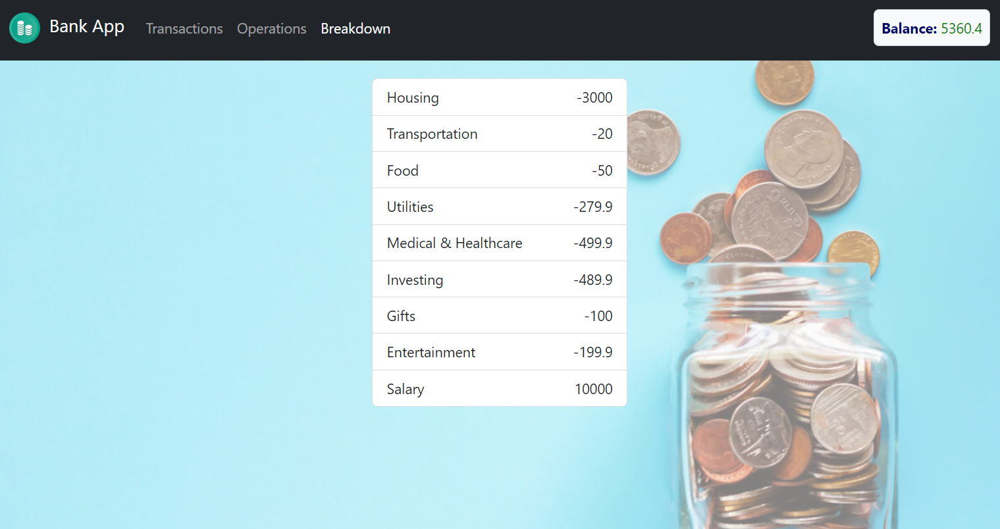
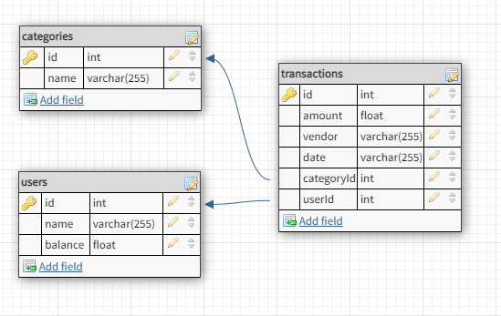

# Bank

## Introduction

A full-stack project, client-side in React and server-side in Python. This is a bank transactions manager, an App that helps us track all the transactions in our bank (deposits and withdraws).

## Running instructions

1. run `create_db.py` inside server folder. It will create the data base with the tables, and some mock- data to start with.

2. run `server.py` inside server folder.

3. run client:

   - navigate to client folder `cd ./client`
   - run `npm install`
   - run `npm start`

## Features

### pages

1.  Landing page - show all transactions.

    We can see the Balance in the top right corner, the Balance is globally seen in all the pages.

    we can also Delete a transaction from this page.

    

        
    

2.  Operations page

    In this page we are able to add a transaction, deposit or Withdraw.

    There is also form validation

    

      
    

3.  Breakdown page

    In this page we can see a breakdown of how much we spent in each category

    

      
    

## Design

### Data Base

    

